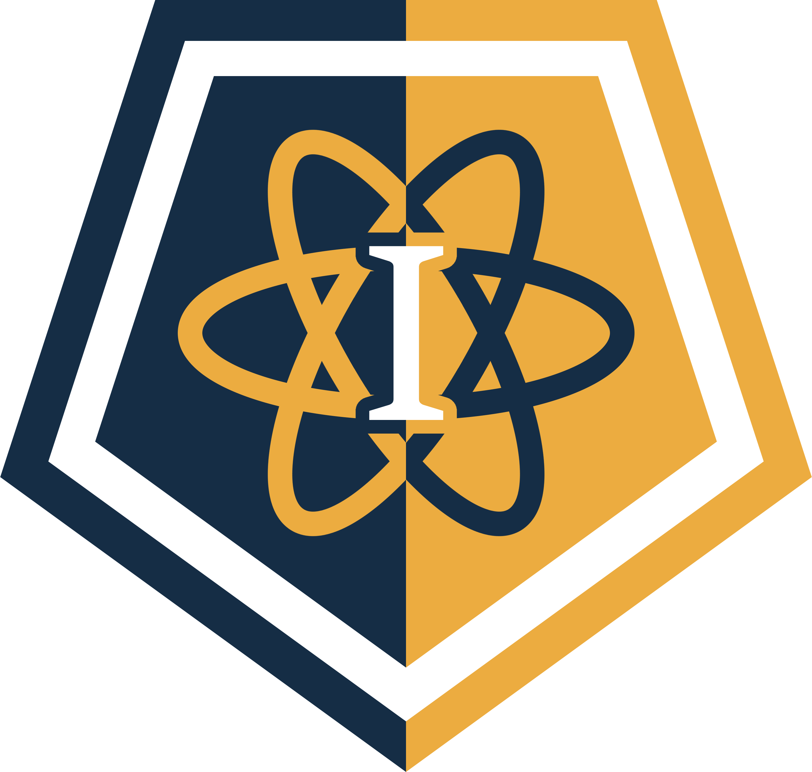

 

## Hello, we are Isaac Oldton !

  
Our application is developed by: Yordan Stoyanov, Damiil Furnika, Petar Matsaliev and Ivan Chelebiev.
The application's goal is to entertain people, while it teaches them various Physics formulas. 
The application consists of a special calculator, a game and a game guide, all very nicely decorated. 
Here is our presentation:
<a href="Documentation/Isaac OLdton-Presentation.pptx" >Presentation</a>

 

# Participants

 

•Yordan Stoyanov - Scrum Trainer  
•Petar Matsaliev - Developer  
•Daniil Furnika - Developer  
•Ivan Chelebiev - QA Engineer   

 

# Used technologies

 

Word  
Teams  
PowerPoint   
 Visual Studio Code  
 Github  

# We hope you to enjoy our site !
